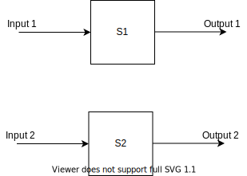
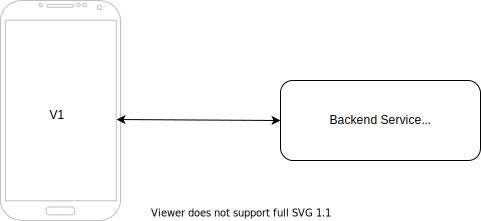

# Backward Compatibilty

I think many might know what backward compatibility means. I learned it from
people and from some random text I guess. I just found out some formal links to
it -

https://en.wikipedia.org/wiki/Backward_compatibility
https://en.wikipedia.org/wiki/Backward_compatibility#Software

I usually like to think of the meaning of backwards compatible like this -

There's a system `S1`, which has been built and it takes input and gives output,
where input and output can be anything. Now, let's say you build another version
of the system `S2` with the same source code, or you build a totally new system
from scratch or something like that, but the systems are related and are trying
to do the same thing or may be the new one is trying to do more things. Now
the new system `S2` is called as backwards compatible based on the below
conditions

I'm going to tell this in a more mathematical way:

If `Input 1` is the input to `S1` and `Output 1` is the output of `S1`,
and `Input 2` is the input to `S2` and `Output 2` is the output of `S2`,
then **If** `Input 1` is equal to `Input 2`, and `Output 1` is equal to
`Output 2`, then the new system `S2` is said to be backwards compatible with
the old system `S1`. 

BUT, **If** `Input 1` is equal to `Input 2` and `Output 1` is NOT equal to
`Output 2`, then the system `S2` is said to be backwards incompatible or
having breaking changes, because of which the user has to change their input
to the new system `S2` to say `Input 1'` to get the desired output `Output 1`
that they got with `S1`

In more simpler terms, given the same input to old and new systems, if the
output is the same, the the new system is said to be compatible with the old
system. If for any reason, for any input, if that does not hold good, then
the new system is said to be incompatible.

How does one know if there's been a breaking or incompatible change in a
software system? Does everyone have to check the source code, run some
functional tests and check if the new system is compatible? Well, there are
ways to do that.

## Semver

People usually version their systems. For example `v1`, `v2`, `v3.4` etc.
They usually use some versioning method. A famous one is https://semver.org/ ,
Semantic Versioning. It has details talking about how the version number
should be changed to show if the new version has changes that are breaking/
incompatible changes, or just has new changes, or has fixes to bugs and that's
it. 

Even if semver is present, it doesn't mean people properly follow them. It
would be great if every team follows it holistically. It's especially useful
when tons of people are using the software, a software that's too big with a
big community and people are running the software in production etc. Any
serious software will try to follow some versioning and stick to it. 

## Changelog

Even with semver and stuff, another thing to checkout for understanding new
versions or new systems is - changelog. Usually softwares release their
softwares along with version number AND changelog too, mentioning the new
changes that have been made, at a high level, in a log or list like format - log
of changes, something like that. The changelog usually mentions if any
breaking changes have been made and what new features have been added and what
fixes have been done. So, it's a good place to look at if you are looking to
find backwards incompatible changes.

## Libraries

What does backwawrds compatibility mean for different softwares? In terms of
libraries, usually they provide APIs - that is functions, methods, types, and
what not, for some feature / functionality. And developers use some package
manager of sorts to manage their packages / libraries / modules / dependencies
(too many words for the same thing 🙈) and get the libraries from some place,
usually called a registry of packages. Now, when new versions of libraries
are released, and developers upgrade their libraries to the newer version,
if the developers don't have to change a single line of code related to the
library during this upgrade - it means that the new version if backwards
compatible. If the new version is a breaking change, the source code would not
work as expected and developers would have to change the input to the library -
for example, change parameters, types, invoke the function with a different
name as name has been changed etc. That's how it would look like for libraries.

## Mobile Apps and Services

Let's say you are building mobile apps and you have backend services for these
mobile apps. Remember, you have two separate systems now - mobile apps and
backend services, usually each has it's own versioning based on the changes made
in each.

Mobile apps access the backend APIs to work correctly. So, let's say you have
mobile app version v1 and backend service v1, and everything works well. Now,
one fine day you make changes in one of the existing endpoints in the backend
service and release it, with no changes in URI path, request method etc, but
only a change in the API response - you rename a field. And if the mobile app
version has not changed, and uses this endpoint, it will break because of this
rename - this is because the mobile app would have been written based on a
contract of the API, expecting the API response in a particular schema /
structure. Now this is inevitable and may be something you already know, if
you are working with backend services or front end systems like web app or
mobile app or desktop app, interacting with backend APIs. So, how does one
tackle this kind of problem?

First of all, surely there must be some testing mechanisms, to make sure that
the mobile app and the backend service work together - there must be integration
tests to help with this. Every time the backend service is released or the
mobile app is released, an integration test suite must run to check if they
work together.

When making changes to the backend service, one must understand what's a
breaking change and what's feature addition, or a bug fix. Usually bug fixes
can be done with 0 changes to the API request or response schema / values.
And API contract is the main thing in our case. It's like the API of libraries.
You need to be careful when you touch the API, interface. For feature addition -
adding features without changes in API contract is awesome - I guess the only
change will be in the API description, or one might add new endpoints to the
API, or features like - adding new query params to GET endpoints, for example
query params for pagination in GET request. These are just some examples.
Another example is adding an extra field in an API response. That's not a
breaking change usually - as the client using the API usually just reads the
response and uses only the parts of the response that it understands, so, if it
doesn't know about a field in the response, it doesn't care, usually. But if
you have some strict contracts, such that if any field is extra in the API
response, then the client will throw errors, that's something you need to take
care based on how it will affect you. So, what are we talking about over here?
When we talk about new fields or similar changes in backend service that is.
Also, remember, you are making changes in backend for the mobile app's newer
version in this case.

Let me show some diagram to you, for the situation I'm talking about -

Mobile App v1 and Backend Service V1

New version v1.1 for both Mobile App and Backend Service. In this case it looks
like both app and service have same version numbers, but it's just for
simplicity we have put this. It's very possible to have totally different
version numbers, for example v1.25 Backend Service and v1.35 Mobile App.

Also, Mobile Apps can have breaking changes too - for various reasons and may
still work with the Backend Service that's running.

But yes, at some point you will have breaking changes, and new changes /
features are going to be there always. And if new features need new features in
backend service, then new version of backend service with the new features must
be present for the new version of mobile app to work. So, even for deployment,
you deploy the backend service first and then release the mobile app. The thing
is - at some point, you will have to put a matrix - to tell what version or
versions of mobile apps work with what versions of backends. The reason for
mobile app not working could be because - some feature is missing in the backend
or because there's a breaking change in the backend.

New endpoint with version change - v2 etc
New field in existing endpoint
