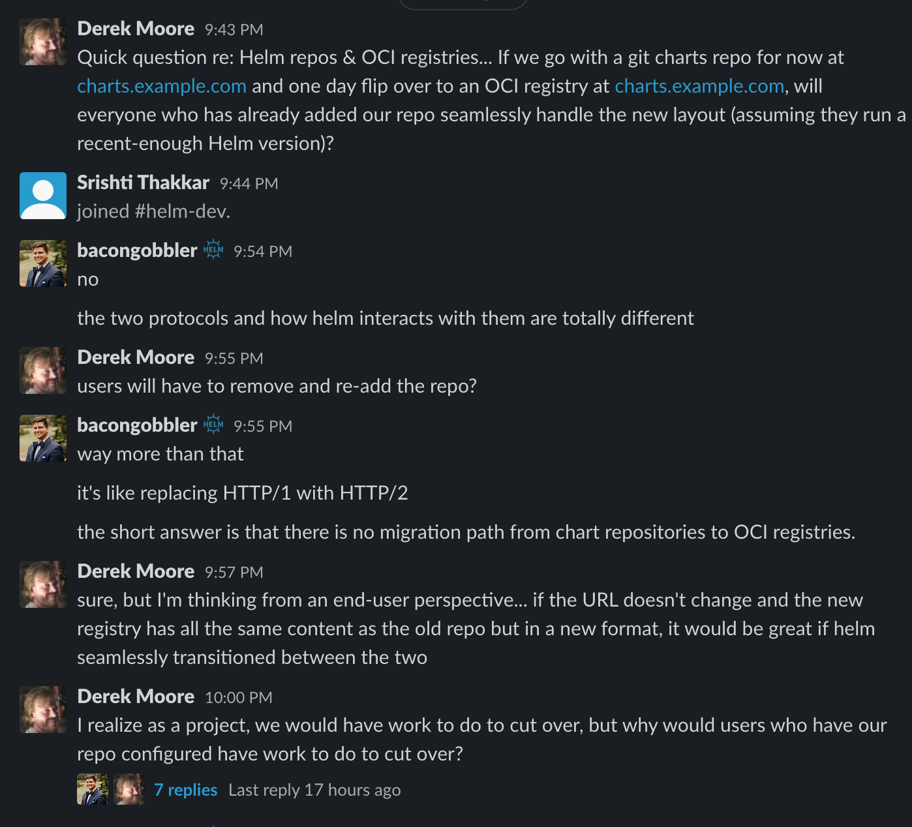

# Migrating to OCI registry

Recently, in the Kubernetes Slack `helm-dev` channel, there were some
conversations around Helm Chart Repository and the OCI (Open Containers
Initiative) registry and about migrations if needed

Check the conversation using these links

Question link
https://kubernetes.slack.com/archives/C51E88VDG/p1592496833461200

There were some answers to the question, but it wasn't a thread, but finally
a thread was started over here

https://kubernetes.slack.com/archives/C51E88VDG/p1592497850465500

Screenshots of the conversation are below

I was thinking if I should create a tool to help people download all their
charts in the chart repo and migrate it to a OCI registry ;) Let's see :)
